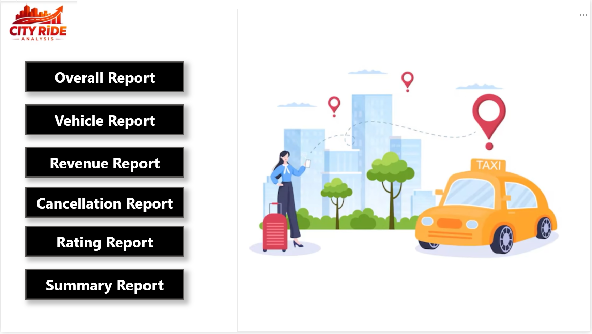
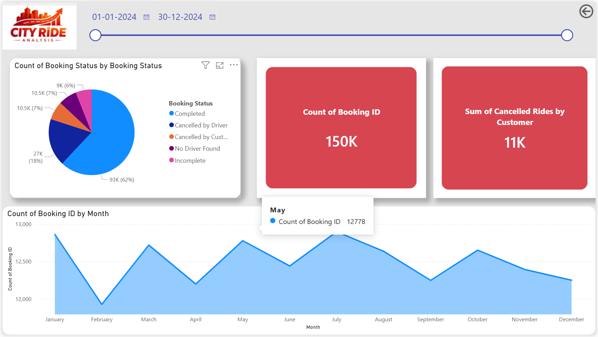

# 📊 [Your Project Name Here, e.g., HR Analytics Dashboard]

## 📝 Project Overview
Briefly describe what your project is about in 2-3 sentences. What problem were you trying to solve? What data did you look at?

## 📄 Live Report Presentation
> 💡 **Quick View:** [Click Here to Open the Full PDF Report](taxi-Fare-Dashboard-Analysis.pdf)  
> *(GitHub will render and open this multi-page visual report directly inside your web browser!)*

---

## 📈 Dashboard Previews
Here is a visual glance at the completed project:

### Page 1: Main Insights


### Data Architecture & Model
Built using a optimized Star Schema data model:


---

## 🛠️ Data Engineering & Modeling Steps Taken
* **Data Cleaning:** Transformed and cleaned raw tables using **Power Query** (fixed data types, replaced null values, and removed duplicates).
* **Data Modeling:** Established 1-to-Many relationships between data tables and dimension tables to maximize report performance.
* **Calculated Measures:** Created custom **DAX** measures to track key business metrics over time.

### Sample DAX Written:
```dax
Total Revenue = SUM(Sales[SalesAmount])
